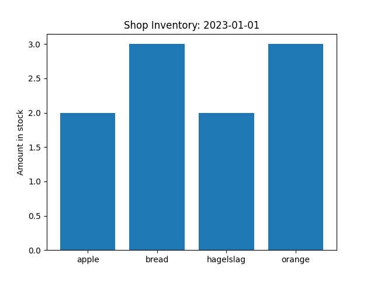

# Report Superpy ############ 
I have learned a lot by doing this assignment. Because I wanted to really understand everything and fix all the bugs that popped up during the programming, it took me a couple of weeks to finish, so a lot more then the 'couple of days mentioned in the assignment. Below I will highlights three technical elements that I find notable.


## Technical element 1
When using argparse for the report subcommand, for most reports (bought, sold, revenue, profit) the analysis could be done for a specific time window. Howrever, for the inventory this is not possible because you always have to take into account the whole history before a specific date. Therefore, I created a error message in case somebody tried to do that:

``` 
if args.command == 'report':
    if args.type == 'inventory':
        if args.timewindow is not None or args.month is not None or args.year is not None or args.today is not False or args.yesterday is not False:
            print('===============================================================================')
            print('Error: For "report inventory" --yesterday/--today/--timewindow/--month/--year does not work')
            print('       because inventory cannot be calculated for a time period')
            print('       Pelease input --date or --now (default) ')
            print('===============================================================================')
            exit() 
```

For example when entering the following code in the command line:
```
python super.py report inventory --timewindow 2023-01-01 2023-04-10
```

You get this error message:

``` 
===============================================================================
Error: For "report inventory" --yesterday/--today/--timewindow/--month/--year does not work
       because inventory cannot be calculated for a time period
       Pelease input --date or --now (default)
===============================================================================
```


## Technical element 2
I ran into some problems when I was programming product selling for a specific date. You can only sell products that are in the inventory on that date, so I called the report_inventory function. However, I still ran into problems because a product can also have been sold in the future. This means that the product is still in the inventory at the date of selling, but will be sold in the future. To fix this, I reloaded the whole sold table, and checked if the product that I was trying to sell was not in that list. Below you can find the code for this. You an also see here that I made a code to select the product that expires soonest.

```
csv_data_sold_all = read_csv(csv_name_sold, 'no')
    sold_bought_id = []
    for sold_poduct_all in csv_data_sold_all[1:]:
        sold_bought_id.append(sold_poduct_all[1])

    exp_date = '3000-01-01'  # initial date far in the furure
    for product_inventory in Inventory:
        bought_id = product_inventory[0]

        # check if product is:
        # 1. in inventory (expired produscts have been removed already)
        # 2. has not been sold yet (also not in the future)
        if args.name == product_inventory[1] and sold_bought_id.count(bought_id) < 1:                
            exp_date2 = product_inventory[4]
            # sell the product that expires the soonest
            if calc_days_diff(exp_date, exp_date2) > 0:  # if next product expires sooner, overwrite with this one
                exp_date = exp_date2
                sold_product = product_inventory
                match = 1
```

## Technical element 3
The last thing I like to highlight is the coding I needed to do to create the bar figure for the inventory summary. For this I needed to create a list of all products in the inventory. To do this I extracted all the names of the products and then removed the duplicates by converting the list to a set. Because a set is not ordered, I converted it back to a list and sorted it:
```
# calculating inventory summary
    product_names = []
    for product in csv_data_bought_not_exp[1:]:  # extracting product names
        product_names.append(product[1])

    product_types = list(set(product_names))  # make a set to remove dupicates
    product_types.sort()  # sort the list
    inventory_summary = [['product_name', 'count']]
    for product_type in product_types:  #creat table
        inventory_summary.append([product_type, product_names.count(product_type)])
```

For the bar figure I used the date in the title of the graph and in the save name:
``` if args.save_inv_bar is True:
            fig, ax = plt.subplots()
            products = []
            counts = []
            table_bar = table[1:]
            for product in table_bar:
                products.append(product[0])
                counts.append(product[1])
            ax.bar(products, counts)  
            ax.set_ylabel('Amount in stock')
            ax.set_title('Shop Inventory: ' + timewindow[1])
            name_bar = 'BARPLOT-' + timewindow[1] + '.png'
            plt.savefig(name_bar)
            plt.show()
```



You can use the following code to create the bar plot yourself:
```
python super.py report inventory --save-inv-bar --date 2023-01-01
```